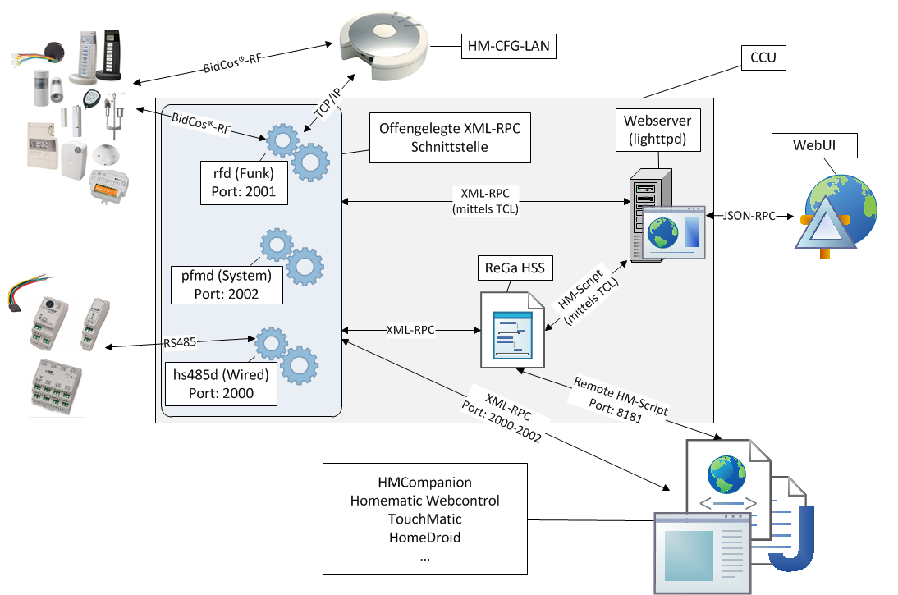

# ioBroker HomeMatic RPC Adapter


[](https://www.npmjs.com/package/iobroker.hm-rpc)
[](https://www.npmjs.com/package/iobroker.hm-rpc)

[](https://nodei.co/npm/iobroker.hm-rpc/)

This adapter connects HomeMatic interface processes (BidCos services, Homegear and CUxD) to ioBroker.
The communication uses XML-RPC or BIN-RPC.

**This adapter uses the service [Sentry.io](https://sentry.io). It reports exceptions, code errors and new device schemas automatically to the developer.**
You find more information in the chapter [What is Sentry.io](#what-is-sentryio).

## What is Homematic?

> Homematic is the smart home system of eQ-3. It allows the comprehensive control of many different functions in a house or in a flat. These functions can be combined in simple scenarios and in complex scenarios.

> The product range contains devices for light control, roller shutter control and heating control, hazard detectors, safety sensors and devices for weather measurement. The radio communication makes it easy to add devices to an existing building. In new buildings, wired bus components can be used.

Source: [Homepage of the manufacturer eQ-3](https://www.eq-3.de/produkte/homematic.html)

## Homematic components in ioBroker

Two adapters are required to manage and to control Homematic components with ioBroker:

### 1. Homematic ReGaHss

This adapter connects to the Homematic logic layer "ReGaHSS" (**Re**sidential **Ga**teway).
It synchronizes the device names, the system variables, the rooms, the functions and the programs between Homematic and ioBroker.

### 2. Homematic RPC

RPC means **R**emote **P**rocedure **C**all. It is a technique for the communication between processes.
This adapter connects to the communication modules of a Homematic central unit (CCU, CCU2, CCU3 and newer).
The following modules are supported:

- `rfd` for radio devices,
- `HMIP-rfd` for Homematic IP devices,
- `hs485d` for wired devices,
- `CUxD` for external components, like EnOcean or FS20 (CUxD is an additional software for the CCU),
- `Homegear` as a replacement for a CCU.

This diagram shows the structure and the communication interfaces:



Source: [wikimatic.de](http://www.wikimatic.de/wiki/Datei:Homematic_Aufbau.png)

## How the adapter works

One instance of the adapter is responsible for exactly one communication module (`rfd`, `hs485d` and so on).
If you want to use several modules at the same time, you must create a separate instance for every module.

The adapter communicates with the module either via BIN-RPC or via XML-RPC.
The communication uses an event interface, so the correct addresses are important.
The CCU sends the events to the adapter automatically, and a cyclic polling is not necessary.

Additionally, the adapter checks the connection to the CCU in a fixed interval.

If you teach in new devices on the CCU, you must enable the option "Synchronize objects (once)" and restart the adapter.
Only then the information about the new Homematic devices is transferred to the adapter.

## Configuration

### Main settings

#### HomeMatic Address

The IP address of the CCU, or of the host on which the BidCos service runs.

#### HomeMatic Port

The port depends on the selected communication module.
The adapter enters the port automatically as soon as you select the daemon.
Change the port only if your ports differ from the standard ports.

The following ports are used by default:

| Daemon          | Communication module   | Standard port             | HTTPS port    |
|-----------------|------------------------|---------------------------|---------------|
| HomeMatic IP    | HMIP-rfd               | 2010                      | 42010         |
| rfd             | rfd (radio devices)    | 2001                      | 42001         |
| Virtual Devices | virtual devices        | 9292                      | 49292         |
| hs485d          | hs485d (wired devices) | 2000                      | 42000         |
| CUxD            | CUxD                   | 8701                      | not supported |
| Homegear        | Homegear               | as configured in Homegear | not supported |

The HTTPS ports work only with the XML-RPC protocol.

#### Adapter Address

The IP address of the host on which the adapter runs.
The CCU uses this address to connect to the adapter, so the CCU must be able to reach this address.
The entries "0.0.0.0 Listen on all IPs" and "127.0.0.1" are only for special cases, because the CCU cannot reach ioBroker at these addresses.

#### Adapter Port

The port on which the adapter waits for the connection of the CCU.
Keep the value "0", so that ioBroker selects a free port automatically.
Change this value only in special cases.

#### Daemon

A CCU supports different device types (radio, wired, Homematic IP, CUxD).
You must create a separate instance of the adapter for every type.

#### Protocol

Two protocols are available for the communication: XML-RPC and BIN-RPC.
BIN-RPC is faster, but some devices do not support it, or they support it incorrectly.
In this case select the XML-RPC protocol.

**Note:** CUxD works only with BIN-RPC. Homematic IP and `rfd` work only with XML-RPC.

#### Synchronize objects (once)

At the first start, the instance reads *all* devices from the CCU.
If you change the configuration later (rename devices, add devices or remove devices), enable this option to synchronize the configuration in ioBroker again.

The instance restarts immediately, reads all devices again and disables this option itself.

### Additional settings

#### Adapter Callback Address

Sometimes ioBroker runs behind a router. In this case the inbound address and the outbound address are different.
Enter the IP address of the router here. The router forwards the traffic to ioBroker by the port number.

If ioBroker runs in a Docker container, enter the IP address of the Docker host here.
You must also forward the adapter port (see "Adapter Port") into the container.
You can select any free port for this, for example, 12001 or 12010.

#### Check communication interval (in seconds)

The adapter sends a ping to the CCU in this interval.

#### Reconnect interval (in seconds)

The adapter waits this time before it starts the next connection attempt.

#### Don't delete devices on adapter start

By default, the adapter removes a device from the object tree if it does not find this device on the CCU at the adapter start.
Enable this option to keep such devices, for example if you removed a device from the CCU only temporarily.

This option also avoids a problem on the CCU side:
Homematic IP devices are sometimes not transferred correctly to ioBroker.
In this case they are deleted at the adapter start, and they are created again some milliseconds later.
For this reason the option is enabled automatically as soon as you select Homematic IP as daemon.

If you delete a device while the adapter is running, the CCU informs the adapter, and the adapter removes this device in any case.

#### Use https

If this option is enabled, the adapter uses HTTPS instead of HTTP.
This works only with the XML-RPC protocol.

#### Username and Password

If the option "Use https" is enabled, enter the user name and the password of a CCU user here.
Enter these credentials also if the API of the CCU requires an authentication.

### Device manager

The tab "Device manager" shows all devices of this instance.
You can rename a device, you can control a device directly, and you can read the installed firmware version and the available firmware version of a device.

## Instances


The installed instances of the adapter are listed in the area *Instances* of ioBroker.
The colored circle on the left side shows whether the instance is enabled and whether it is connected to the CCU.

If you move the mouse pointer over a symbol, you get detailed information.

## Objects of the adapter

The area *Objects* shows all values and all information that the CCU sends to the adapter. The values are shown in a tree structure.

Which objects and which values are shown depends on the devices (function and channels) and on the structure inside the CCU.

The central unit uses the ID `BidCoS-RF`, and all virtual buttons are listed under this ID.
Devices are created under their serial number, and groups get the name `INT000000x`.

### Channel 0 (all devices)

This channel is created for every device. It contains the following function data:

| Data point                       | Meaning                                                            |
|----------------------------------|--------------------------------------------------------------------|
| AES_Key                          | Encryption enabled or disabled                                     |
| Config (Pending / Pending Alarm) | Pending configuration                                              |
| Dutycycle / Dutycycle Alarm      | Transmission time of the Homematic devices                         |
| RSSI (Device / Peer)             | Signal strength between the device and the central unit            |
| Low Bat / Low Bat Alarm          | Low battery charge                                                 |
| Sticky unreach / unreach alarm   | System message about a communication error (error occurred before) |
| Unreach / unreach alarm          | System message about a communication error (current state)         |

### Channels 1 to 6

These channels contain measured values, control data and status data.
The shown data depends on the function of the device. The following table shows some examples:

| Function                        | Channel | Possible values                                                                  |
|---------------------------------|---------|----------------------------------------------------------------------------------|
| Sensors                         | 1       | Temperature, humidity, fill level, open or closed state and so on                |
| Heating thermostats             | 4       | Operating mode, set temperature, actual temperature, valve position and so on    |
| Actuators                       | 1       | Level (roller shutter, dimmer), direction of movement (roller shutter) and so on |
| Devices with measuring function | 3       | Status                                                                           |
|                                 | 6       | Consumption meter, voltage, power and so on                                      |

## Custom commands

You can send custom commands to the adapter, for example, to read and to control the MASTER area of a device.
The MASTER area allows you to configure the weekly heating programs and more.

Send a message to the adapter for this purpose.
The message contains the method as the first parameter, followed by an object.
This object must contain the `ID` of the target device. Optionally it contains the `paramType`, which selects, for example, the MASTER area.
Send additional parameters in the `params` object.

**Examples:**

Write all values of the MASTER area of a device to the log:

```javascript
sendTo('hm-rpc.0', 'getParamset', {ID: 'OEQ1861203', paramType: 'MASTER'}, res => {
    log(JSON.stringify(res));
});
```

Set an attribute of the MASTER area to a specific value:

```javascript
sendTo('hm-rpc.0', 'putParamset', {ID: 'OEQ1861203', paramType: 'MASTER', params: {'ENDTIME_FRIDAY_1': 700}}, res => {
    log(JSON.stringify(res));
});
```

List all devices:

```javascript
sendTo('hm-rpc.0', 'listDevices', {}, res => {
    log(JSON.stringify(res));
});
```

Set a value, like the adapter does it on `stateChange`:

```javascript
sendTo('hm-rpc.1', 'setValue', {ID: '000453D77B9EDF:1', paramType: 'SET_POINT_TEMPERATURE', params: 15}, res => {
    log(JSON.stringify(res));
});
```

Read the `paramsetDescription` of a channel of a device:

```javascript
sendTo('hm-rpc.1', 'getParamsetDescription', {ID: '000453D77B9EDF:1', paramType: 'VALUES'}, res => {
    log(JSON.stringify(res));
});
```

Read the firmware information of a device. In this example the firmware status is written to the log:

```javascript
sendTo('hm-rpc.1', 'getDeviceDescription', {ID: '0000S8179E3DBE', paramType: 'FIRMWARE'}, res => {
    if (!res.error) {
        log(`FW status: ${res.result.FIRMWARE_UPDATE_STATE}`)
    } else {
        log(res.error)
    }
});
```

## Additional information

If you use HomeMatic switches or HomeMatic remote controls, the CCU confirms the button states only if a "dummy" program runs on the CCU.
This program must use the state of the related switch or of the related remote control.
Without such a program, ioBroker does not get the button states.

You can use one single dummy program for several buttons.
Add all button states to the if-clause and combine them with the operator "or" or with the operator "and".
The then clause of the program can stay empty.
After that, the state in ioBroker is updated on every button press.

## What is Sentry.io?

Sentry.io is a service for developers. It gives an overview about the errors of their applications. Exactly this is implemented in this adapter.

If the adapter crashes, or if another code error happens, the error message is sent to Sentry. The same message also appears in the ioBroker log.
If you allowed the ioBroker GmbH to collect diagnostic data, your installation ID is sent too.
This installation ID is only a unique ID **without** any additional information about you, like your email address or your name.
It allows Sentry to group the errors and to show how many users are affected by an error.
All of this helps the developer to provide adapters that are free of errors and that basically never crash.

## Development

To update all device images, execute the following command:

```bash
npm run update-images
```

## Changelog
<!--
	Placeholder for the next version (at the beginning of the line):
	### **WORK IN PROGRESS**
-->
### 4.0.0 (2026-08-15)
* (bluefox) Device icons are now delivered as theme-adaptive SVGs and stay visible on the dark admin theme
* (krobipd) Generated the device icon set and the device type map from the OCCU device database
* (krobipd) The device icon is re-applied on start to devices that were created before their type had an icon
* (bluefox) Removed support of Node.js 20

### 3.0.2 (2026-05-07)
* (bluefox) Updated packages
* (bluefox) Migrated to TypeScript 6
* (bluefox) Corrected device manager

### 3.0.1 (2025-10-22)
* (bluefox) Renamed role of `STICKY_UNREACH` to `indicator.unreach.sticky` for the better typing detection

### 3.0.0 (2025-10-21)
* (bluefox) Updated packages and used `@iobroker/eslint-config`
* (bluefox) Renamed some roles for the better typing detection
* (bluefox) Removed support of Node.js 18

### 2.0.2 (2024-08-26)
* (bluefox) Updated packages

### Older entries
[here](OLD_CHANGELOG.md)

[Older changelogs can be found there](CHANGELOG_OLD.md)

## License

The MIT License (MIT)

Copyright (c) 2014-2026 bluefox <dogafox@gmail.com>

Copyright (c) 2014 hobbyquaker

Permission is hereby granted, free of charge, to any person obtaining a copy
of this software and associated documentation files (the "Software"), to deal
in the Software without restriction, including without limitation the rights
to use, copy, modify, merge, publish, distribute, sublicense, and/or sell
copies of the Software, and to permit persons to whom the Software is
furnished to do so, subject to the following conditions:

The above copyright notice and this permission notice shall be included in
all copies or substantial portions of the Software.

THE SOFTWARE IS PROVIDED "AS IS", WITHOUT WARRANTY OF ANY KIND, EXPRESS OR
IMPLIED, INCLUDING BUT NOT LIMITED TO THE WARRANTIES OF MERCHANTABILITY,
FITNESS FOR A PARTICULAR PURPOSE AND NONINFRINGEMENT. IN NO EVENT SHALL THE
AUTHORS OR COPYRIGHT HOLDERS BE LIABLE FOR ANY CLAIM, DAMAGES OR OTHER
LIABILITY, WHETHER IN AN ACTION OF CONTRACT, TORT OR OTHERWISE, ARISING FROM,
OUT OF OR IN CONNECTION WITH THE SOFTWARE OR THE USE OR OTHER DEALINGS IN
THE SOFTWARE.
