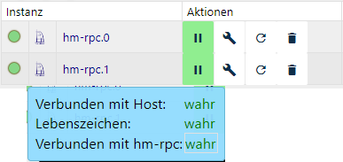

# HomeMatic RPC

## Homematic
>Homematic ist ein Smart Home System von eQ-3, das die umfassende Steuerung
unterschiedlichster Funktionen mithilfe von Szenarien (von einfach bis komplex)
in Haus oder Wohnung ermöglicht.

>Die Geräte beinhaltet Produkte zur Licht-, Rollladen- und Heizungssteuerung,
Gefahrenmelder, Sicherheitssensoren und Produkte zur Wetterdatenmessung. Die
Funkkommunikation vereinfacht dabei das Nachrüsten. In Neubauten können
Drahtbus-Komponenten eingesetzt werden.
<a href="https://www.eq-3.de/produkte/homematic.html" title="Homepage des Herstellers eQ3">
Quelle</a>

## Verwaltung und Steuerung von Homematic-Komponenten mit ioBroker
Um Homematic-Komponenten mit ioBroker optimal zu verwalten und zu steuern
werden zwei Adapter benötigt:

### 1. Homematic ReGaHss

Dieser Adapter stellt eine Verbindung zur Homematic Logikschicht „ReGaHSS“ 
(**Re**sidential **Ga**teway) her.
Er synchronisiert Klarnamen, Systemvariablen, Räume, Gewerke und Programme
zwischen Homematic und ioBroker.

### 2. Homematic RPC

Der **R**emote **P**rocedur **C**all, kurz RPC ist eine Technik zur Realisierung
von Interprozesskommunikation. Dieser Adapter bietet die Anbindung an die
Kommunikationsmodule einer Homematic-Zentrale (CCU/CCU2/CCU3 ...). Es werden die
Module rfd (Funk), HMIP-rfd, hs485d (wired), CuxD (Zusatzsoftware zur Anbindung
externer Komponenten wie EnOcean, FS20 usw.) und Homegear (CCU Ersatz)
unterstützt.

Dieses Diagramm veranschaulicht den Aufbau und die Kommunikationsschnittstellen:


[Quelle](http://www.wikimatic.de/wiki/Datei:Homematic_Aufbau.png)

## Adapter Homematic RPC

Dieser Adapter bietet die Anbindung an die Kommunikationsmodule einer
Homematic-Zentrale (CCU/CCU2/CCU3 ...). Eine Instanz des
Adapters ist für genau EIN Module (rfd, wired usw.) zuständig. Sollen mehrere Module
parallel unterstützt werden, muss für jedes Modul eine eigene Instanz
installiert werden.

Die Kommunikation des Adapters mit dem entsprechenden Modul erfolgt entweder
über BIN-RPC oder XML-RPC. Da über eine Ereignisschnittstelle gearbeitet wird,
ist die korrekte Adressierung wichtig. So werden Ereignisse automatisch dem
Adapter übermittelt und ein zyklisches Pollen ist nicht notwendig.

Zusätzlich verfügt der Adapter über die Funktionalität, die Verbindung zur CCU
zyklisch zu überwachen.

Werden neue Geräte an der CCU angelernt, so muss der Adapter mit der
Konfiguration “Initiiere Geräte neu (einmalig)” neu gestartet werden. Dadurch
werden die Informationen der neuen Homematic-Geräte an den Adapter übertragen.

## Konfiguration

### Haupteinstellungen

### HomeMatic Adresse

IP-Adresse der CCU bzw. des Hosts, auf dem der BidCos-Service der Homematic
läuft.

### HomeMatic Port

Die Einstellung des Ports hängt von dem benötigtem Kommunikationsmodul ab, wird
bei der Auswahl des Daemons automatisch eingetragen und sollte nur geändert
werden, wenn die Ports vom Standard abweichen.

Standardmäßig sind folgende Ports vorgesehen:

| Kommunikationsmodul | Standardport | HTTPS-Port |
|---------------------|--------------|------------|
| Funkgeräte (RFD)    | 2001         | 42001      |
| Wired               | 2000         | 42000      |
| CUxD                | 8701         | \--        |
| Homematic IP        | 2010         | 42010      |

### Daemon

CCU/Homematic unterstützt unterschiedliche Gerätetypen (wired, Funk, HMIP,
CUxD). Für jeden Typ muss eine eigene Instanz angelegt warden.

### Protokoll

Zur Kommunikation werden zwei Protokolle zur Verfügung gestellt: XML-RPC und
BIN-RPC.

*CUxD benötigt zwingend das BIN-RPC-Protokoll; HMIP und RFD das XML-RPC-Protokoll.*

### Synchronisiere Geräte neu (einmalig)
Beim erstmaligen Start des Adapters werden alle Geräte eingelesen. Werden später
Änderungen innerhalb der CCU durchgeführt (Umbennung von Geräten, hinzufügen
neuer Geräte usw.) ist diese Auswahl zu aktivieren und mit „Speichern und
Schließen“ der Neustart des Adapters zu veranlassen.

### Adapter Addresse
Im Pulldown-Menü wird die IP des Hosts ausgewählt, auf dem der Adapter
installiert ist. Die Auswahl von "0.0.0.0. auf alle IPs hören" und "127.0.0.1"
ist Spezialfällen vorbehalten.

### Adapter Port
Standardmäßig ist hier Port "0" für die automatische Selektion des
ioBroker-Ports eingestellt und sollte nur in Ausnahmefällen verändert werden.

## Zusätzliche Einstellungen
### Adapter Callback Addresse
Wenn ioBroker hinter einem Router (z.B. in einem Docker-Container) läuft, können
sich Ein- und Ausgangsadresse unterscheiden. Wird hier die IP des Routers
eingetragen, lässt sich das Problem umgehen, da dann das Weiterleiten zu
ioBroker vom Router übernommen wird.

### Verbindungs-Check Intervall (sec)
Im festgelegten Intervall wird eine Ping-Anfrage an die CCU gesendet.

### Wiederverbindungs-Intervall (sec)
Zeitspanne, nach der ein erneuter Verbindungsversuch gestartet wird.

### Geräte nicht löschen
Geräte werden standardmäßig auch aus der Objektliste entfernt, wenn sie
innerhalb der CCU abgelernt wurden. Um diese Geräte in der Objektliste zu
behalten, beispielweise weil sie nur temporär entfernt wurden, kann diese Option
aktiviert werden.

### Nutze HTTPS
Ist diese Option aktiviert, wird eine sichere Verbindung hergestellt.
Funktioniert nur mit XML-RPC Protokoll.

### Nutzername und Passwort
Bei Nutzung von HTTPS oder falls für die API der CCU eine Authentifikation
erforderlich ist, sind die Daten hier einzutragen.

## Instanz



Unter *Instanzen* des ioBrokers finden sich die installierte Instanze des
Adapters. Links ist im Ampelsystem visualisiert, ob der Adapter aktiviert und
mit der CCU verbunden ist.

Platziert man den Mauszeiger auf ein Symbol, erhält man Detailinformationen.

## Objekte des Adapters
Im Bereich Objekte werden in einer Baumstruktur alle von der CCU dem Adapter
übermittelten Werte und Informationen dargestellt.

Welche Objekte und Werte angezeigt werden, ist von den Geräten (Funktion und
Kanäle) und der Struktur innerhalb der CCU abhängig. 

Die Zentrale wird mit der ID BidCoS-RF gekennzeichnet (hierunter sind alle virtuellen Tasten aufgeführt),
Geräte werden unter ihrer Seriennummer angelegt und Gruppen mit
INT000000*x* bezeichnet.

### Kanal 0 (alle Geräte)
Dieser Kanal wird für jedes Gerät angelegt und enthält Funktionsdaten, nachfolgend eine kurze Übersicht:

| *Datenpunkt*                   | *Bedeutung*                                            |
|--------------------------------|--------------------------------------------------------|
| AES_Key                        | Verschlüsselte Aktivierung aktiv/deaktiv               |
| Config (Pending/Pending Alarm) | Ausstehende Konfiguration                              |
| Dutycycle / Dutycycle Alarm    | Sendezeit Homematic Geräte                             |
| RSSI (Device/Peer)             | Funkstärke (Gerät \<-\> Zentrale)                      |
| Low Bat/Low Bat Alarm          | niedrige Batterieladung                                |
| Sticky unreach / unreach alarm | Systemmeldung Kommunikationsfehler (Störung lag vor)   |
| Unreach/unreach alarm          | Systemmeldung Kommunikationsfehler (aktueller Zustand) |

### Kanal 1-6
Hier sind Messwerte, Steuerungs- und Zustandsdaten aufgelistet; je nach Funktion
des Gerätes werden unterschiedliche Daten angezeigt. Nachfolgend ein kurzer
Auszug:

| *Funktion*              | *Kanal* | *Mögliche Werte*                                          |
|-------------------------|---------|-----------------------------------------------------------|
| Sensoren                | 1       | Temperatur, Feuchtigkeit, Füllstand, Öffnungszustand usw. |
| Heizungsthermostate     | 4       | Betriebsmodi, Soll-/Ist-Temperatur, Ventilstellung usw.   |
| Aktoren                 | 1       | Level (Rollladen, Dimmer), Laufrichtung (Rolllladen) usw. |
| Geräte mit Messfunktion | 3       | Status                                                    |
|                         | 6       | Verbrauchszähler, Spannung, Leistung usw.                 |

## FAQ

## Was ist Sentry.io und was wird an die Server dieses Unternehmens gemeldet?

Sentry.io ist ein Dienst, der Entwicklern einen Überblick über Fehler in ihren Anwendungen bietet. Genau dies wird in diesem Adapter implementiert.

Wenn der Adapter abstürzt oder ein anderer Codefehler auftritt, wird diese Fehlermeldung, die auch im ioBroker-Protokoll erscheint, an Sentry übermittelt. Wenn Sie der ioBroker GmbH die Berechtigung zur Erfassung von Diagnosedaten erteilt haben, wird auch Ihre Installations-ID (eine eindeutige ID **ohne** weitere Informationen wie E-Mail-Adresse, Name usw.) übermittelt. Dadurch kann Sentry Fehler gruppieren und die Anzahl der betroffenen Benutzer anzeigen. All dies hilft mir, fehlerfreie Adapter bereitzustellen, die praktisch nie abstürzen.


## Benutzerdefinierte Befehle

Es ist möglich, benutzerdefinierte Befehle zu senden, z. B. um den Masterbereich eines Geräts auszulesen und zu steuern, der es dem Benutzer ermöglicht, Heizwochenprogramme und mehr zu konfigurieren.

Dies geschieht durch das Senden einer Nachricht an den Adapter, die die Methode als ersten Parameter enthält, gefolgt von einem Objekt, das die … enthalten muss.`ID` des Zielgeräts sowie optional die`paramType` , wodurch beispielsweise der MASTER-Bereich festgelegt wird. Zusätzliche Parameter müssen in der`params` Objekt.

**Beispiele:**

Alle Werte des MASTER-Bereichs eines Geräts protokollieren:

```javascript
sendTo('hm-rpc.0', 'getParamset', {ID: 'OEQ1861203', paramType: 'MASTER'}, res => {
    log(JSON.stringify(res));
});
```

Einem Attribut des MASTER-Bereichs einen bestimmten Wert zuweisen:

```javascript
sendTo('hm-rpc.0', 'putParamset', {ID: 'OEQ1861203', paramType: 'MASTER', params: {'ENDTIME_FRIDAY_1': 700}}, res => {
    log(JSON.stringify(res));
});
```

Alle Geräte auflisten:

```javascript
sendTo('hm-rpc.0', 'listDevices', {}, res => {
    log(JSON.stringify(res));
});
```

Legen Sie einen Wert fest, so wie es der Adapter tut.`stateChange` :

```javascript
sendTo('hm-rpc.1', 'setValue', {ID: '000453D77B9EDF:1', paramType: 'SET_POINT_TEMPERATURE', params: 15}, res => {
    log(JSON.stringify(res));
});
```

Hol dir das`paramsetDescription` des Kanals eines Geräts:

```javascript
sendTo('hm-rpc.1', 'getParamsetDescription', {ID: '000453D77B9EDF:1', paramType: 'VALUES'}, res => {
    log(JSON.stringify(res));
});
```

Firmware-Informationen eines Geräts abrufen (in diesem Fall protokollieren wir den FW-Status):

```javascript
sendTo('hm-rpc.1', 'getDeviceDescription', {ID: '0000S8179E3DBE', paramType: 'FIRMWARE'}, res => {
    if (!res.error) {
        log(`FW status: ${res.result.FIRMWARE_UPDATE_STATE}`)
    } else {
        log(res.error)
    }
});
```


## Weitere Informationen

Wenn Sie HomeMatic-Schalter oder -Fernbedienungen verwenden, werden deren Tastenzustände von der CCU und damit von ioBroker nur dann erkannt, wenn auf der CCU ein „Dummy“-Programm läuft, das von dem entsprechenden Schalter oder der Fernbedienung abhängt.

Sie können ein einziges Dummy-Programm für mehrere Schaltflächen verwenden, indem Sie einfach alle Schaltflächenzustände in der if-Anweisung mit einem or/and-Operator verknüpfen. Die then-Anweisung des Programms kann leer bleiben. Der Zustand der Schaltfläche wird nun bei jedem Tastendruck aktualisiert.


## Changelog
<!--
	Placeholder for the next version (at the beginning of the line):
	### **WORK IN PROGRESS**
-->
### 4.0.0 (2026-08-15)
* (bluefox) Device icons are now delivered as theme-adaptive SVGs and stay visible on the dark admin theme
* (krobipd) Generated the device icon set and the device type map from the OCCU device database
* (krobipd) The device icon is re-applied on start to devices that were created before their type had an icon
* (bluefox) Removed support of Node.js 20

### 3.0.2 (2026-05-07)
* (bluefox) Updated packages
* (bluefox) Migrated to TypeScript 6
* (bluefox) Corrected device manager

### 3.0.1 (2025-10-22)
* (bluefox) Renamed role of `STICKY_UNREACH` to `indicator.unreach.sticky` for the better typing detection

### 3.0.0 (2025-10-21)
* (bluefox) Updated packages and used `@iobroker/eslint-config`
* (bluefox) Renamed some roles for the better typing detection
* (bluefox) Removed support of Node.js 18

### 2.0.2 (2024-08-26)
* (bluefox) Updated packages

### Older entries
[here](OLD_CHANGELOG.md)

[Older changelogs can be found there](CHANGELOG_OLD.md)

## License

The MIT License (MIT)

Copyright (c) 2014-2026 bluefox <dogafox@gmail.com>

Copyright (c) 2014 hobbyquaker

Permission is hereby granted, free of charge, to any person obtaining a copy
of this software and associated documentation files (the "Software"), to deal
in the Software without restriction, including without limitation the rights
to use, copy, modify, merge, publish, distribute, sublicense, and/or sell
copies of the Software, and to permit persons to whom the Software is
furnished to do so, subject to the following conditions:

The above copyright notice and this permission notice shall be included in
all copies or substantial portions of the Software.

THE SOFTWARE IS PROVIDED "AS IS", WITHOUT WARRANTY OF ANY KIND, EXPRESS OR
IMPLIED, INCLUDING BUT NOT LIMITED TO THE WARRANTIES OF MERCHANTABILITY,
FITNESS FOR A PARTICULAR PURPOSE AND NONINFRINGEMENT. IN NO EVENT SHALL THE
AUTHORS OR COPYRIGHT HOLDERS BE LIABLE FOR ANY CLAIM, DAMAGES OR OTHER
LIABILITY, WHETHER IN AN ACTION OF CONTRACT, TORT OR OTHERWISE, ARISING FROM,
OUT OF OR IN CONNECTION WITH THE SOFTWARE OR THE USE OR OTHER DEALINGS IN
THE SOFTWARE.
